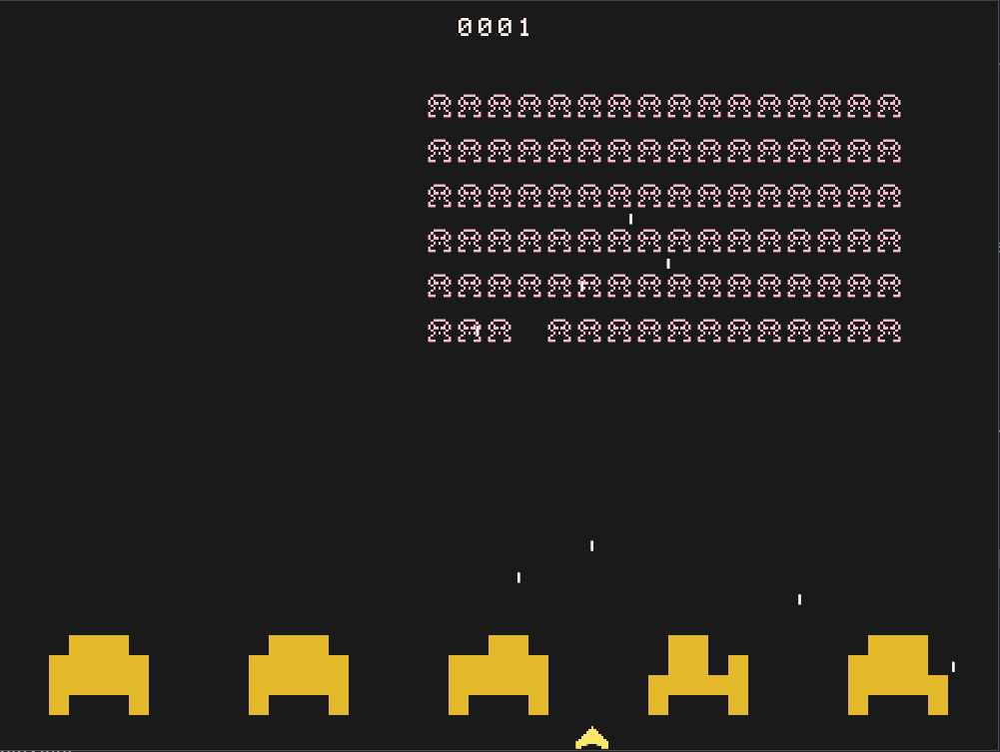

# Space Invaders ECS
A Space Invaders game built with Bevy 0.16 and ECS in Rust, created as an educational exercise to demonstrate 2D game development with Bevy.

  
  
Screenshot of the Space Invaders ECS game in action.

WARNING: This is my first Rust project, created after 7 days of learning Rust and Bevy. The code is not a model of best practices but serves as a learning resource for others interested in Bevy and ECS.

This project was inspired by [Biped-Potato’s Bevy Space Invaders](https://github.com/Biped-Potato/bevy_space_invaders), used as a starting point and significantly expanded.

## Code Orientation

Copy [collated_src.txt](assets/collated_src.txt) into your favourite AI and discuss the code with it. For example, Grok identified the following weaknesses in the ECS design:

## Weaknesses

>> Centralization in Resources and Systems:

AlienManager resource acts like a "manager class," holding formation state (direction, shift flags, boundary distance). Systems like advance_aliens_horizontally derive state from entities but store it back in the resource. This violates pure ECS by introducing a singleton-like coordinator.

Critique: In stricter ECS, formation state should emerge from entity data (e.g., query all aliens to compute min/max X for boundaries). The current approach works but reduces parallelism (systems chain on the resource) and makes debugging harder (state isn't localized to entities).

Some systems are multi-responsibility: adjust_alien_formation handles shifting, direction reversal, speed increment, and full wave reset (despawn/respawn). This could be split (e.g., separate shift_formation and reset_wave systems) for better maintainability.

>> Collision Handling:

Brute-force nested queries in update_collisions are simple but inefficient for growth. No spatial partitioning (e.g., quadtree via resource or component).

Critique: While fine here, it doesn't scale ECS-style—larger games need systems that batch collisions (e.g., via Bevy's rapier plugin). Also, it skips certain checks (e.g., player bullets vs. player) with if-guards, which could be query filters instead.

Collision resolution is imperative: Inserts Dead, adjusts bullet counts, sends events in a loop. This mixes detection and response; separating into detection (gather pairs) and resolution systems would be more ECS-pure.

>> Event and State Management:

Events are underused: Wave clearing relies on check_all_aliens_dead querying for empty aliens, setting a reset flag in AlienManager. An event (e.g., WaveCleared) would decouple this from the manager.

Game speed increments are scattered (e.g., on alien kill, shift down, wave clear). A centralized speed-adjust system reading events would consolidate this.

## License

This project is licensed under the MIT License. See the LICENSE file for details.

## Third-Party Assets

### Fonts
This project uses the space_invaders.ttf font by chriswal1200, licensed under the SIL Open Font License, Version 1.1. See `assets/fonts/space_invaders/license.txt` for license details.

### Sfx

Sound effects are not included in this repository due to unclear licensing. To run the game with sound, obtain the following files from a licensed source and place them in the assets/sfx folder.

See:

https://ronjeffries.com/articles/020-invaders-30ff/i-37/ (see Invaders.zip linked at very bottom of page)

or

https://www.classicgaming.cc/classics/space-invaders/sounds (download sounds individually)

### Palette

The gilt-8 palette by tomicit0 is used for colors.

https://lospec.com/palette-list/gilt-8

## Disclaimer

This project is for educational purposes only. The code and included assets are not intended for commercial use or public distribution outside of learning environments. Users must ensure compliance with the licenses of all third-party assets before using or distributing this project. The creator is not responsible for any misuse of the project or its assets.

If you plan to use this project beyond personal learning, replace all third-party assets with properly licensed alternatives and ensure compliance with the MIT License for the code.

## Installation

- Ensure [Rust](https://www.rust-lang.org/learn/get-started) and [Bevy 0.16](https://bevy.org/learn/quick-start/getting-started) dependencies are installed.
- Clone this repository.
- Place sound effect files in assets/sfx or use alternatives.
- Run the game with cargo run.

## Acknowledgments

Inspired by the classic Space Invaders game by Taito.
